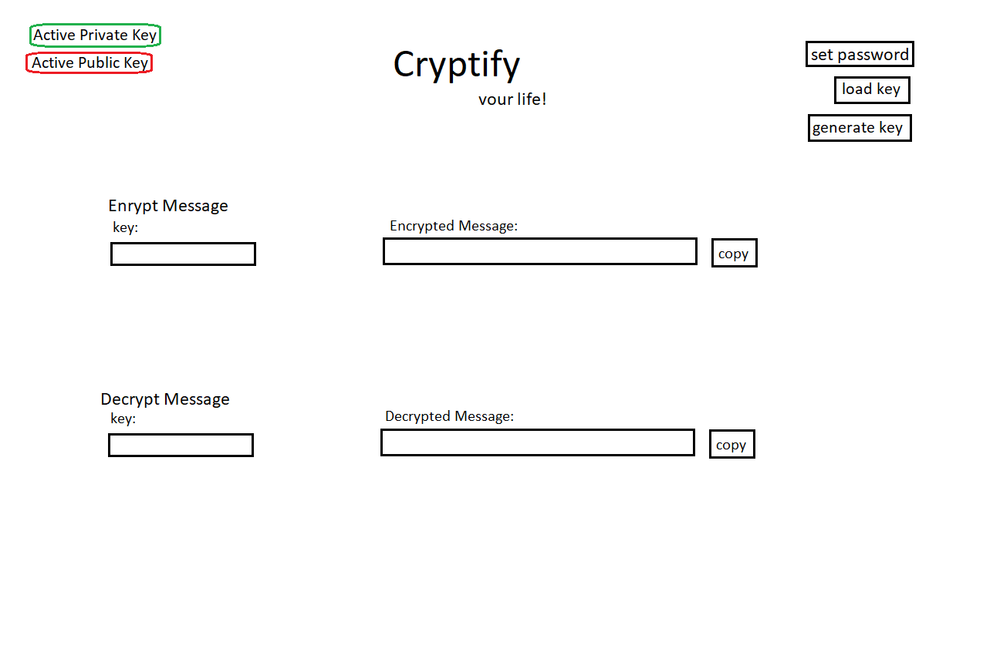
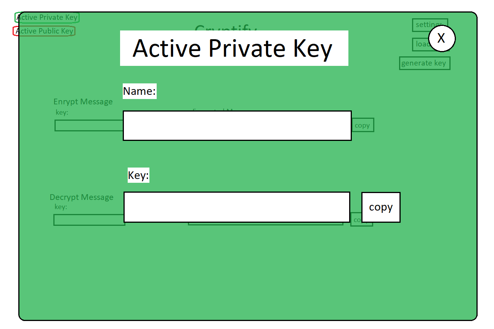
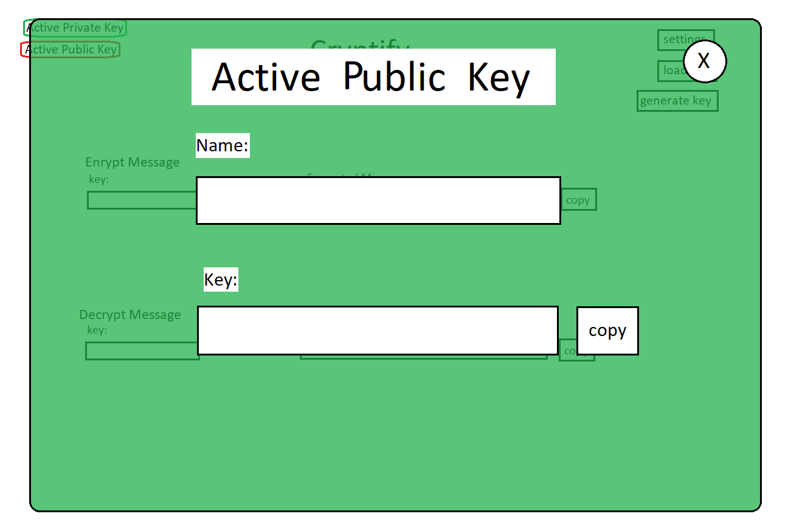
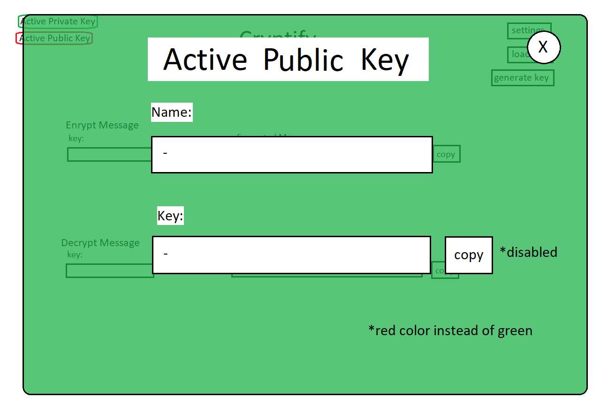
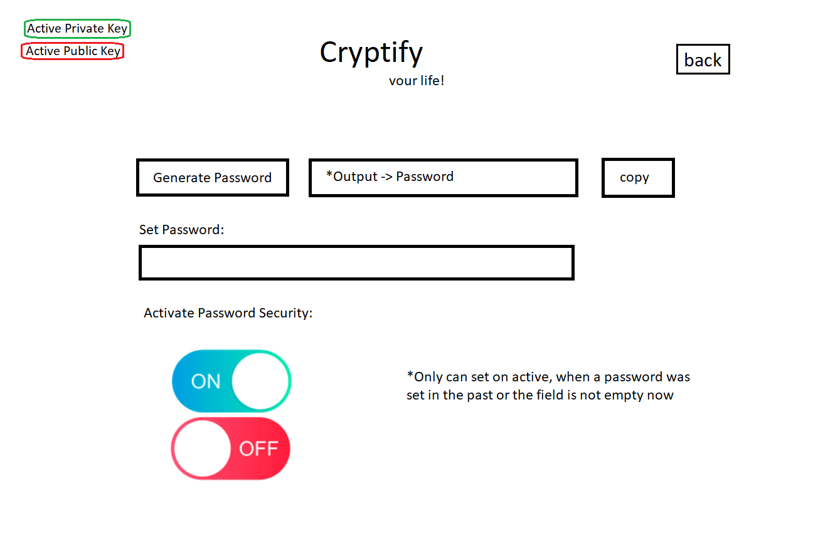

# 🔥Crypticor🔥
> Crypticor, your digital crypt to safe your loved data

Key Points:

- Cryptography made easy with Crypticor

- Secure your secrets with Crypticor

- Protect your privacy with Crypticor

- Unlock the power of cryptography with Crypticor

- Keep your data safe with Crypticor's encryption

- Easy to use GUI

  

The mystical crypt is shrouded in secrecy, hidden away from prying eyes in a location known only to a select few. Its entrance is guarded by a heavy stone door, etched with mysterious symbols that seem to glow in the dim light. The air inside is thick and musty, and the only sound is the occasional drip of water from the damp stone ceiling. As you move deeper into the crypt, the darkness seems to close in around you, and you can feel the weight of centuries of history bearing down upon you. It's a place where secrets are kept safe, and the mysteries of the past are hidden away.

---
### Description & Features

Simple Program for easy use of cryptography with a simple GUI.

Goal is that everyone can easily encrypt messages with that application. It's not structered for commercial use. More for "fun"

 use. But it should really work and it should be secure. You also can use the private and public keys for signature.

Features: 
- Create Private and Public keys (and saving in cache)
- Local safe of public and private keys
- Encrypt messages (and saving in cache)
- Decrypt messages (and saving in cache)
- GUI for the usage
- Windows App
- Android App
- Adding more than only Strings as data? 
- Adding Hashing Features (which should be added?)

---

### To Do:

- [x] planning and concept
- [ ] program the fundamental cryptify python file
  - [ ] Add Encrypt and Decrypt mechanism (with AES and RSA)
  - [ ] Add local safe (with keyring modul)
  - [ ] Add password-security & management of keys 
  - [ ] Password for the system (optional)
  - [ ] Add active private and public key system -> there can be always one public and one private be active
- [ ] Add licence (MIT?)
- [ ] GUI programming for Android and Windows
- [ ] Porting for Android and Windows (publishing in PlayStore + exe download or adding in WindowsStore)
- [ ] Complete Documentation

---

### Choice of Encrypt-Library

There are several good options for cryptgraphy-libs in python. Following there is a list of existing (commonly used) cryptgraphy-libraries in Python. 

- [crypt](https://docs.python.org/3/library/crypt.html)
- [bcrypt](https://pypi.org/project/bcrypt/)
- [PyCrypto](https://pypi.org/project/pycrypto/)
- [cryptography](https://pypi.org/project/cryptography/)
- [Passlib](https://pypi.org/project/passlib/)
- [PyNaCl](https://pypi.org/project/PyNaCl/)

It is not recommend to implement such algorithms by yourself. Therefore **PyNaCl** will be used in this project for the cryptography.

It's a library which efforts all needed features and is a Python Binding of the popular [libsodium](https://github.com/jedisct1/libsodium) library which is written in C. 

---

### Usage

- how to send and read a message crypted/securely?
- how to send a signature and how to check a signature?

---
### Concept

The design is inspired by a crypt.  
-> On the images the crypt motive is missing. 
Mood-Board:
- Fire
- Old Stone
- Dripping Water
- Candles
- Silence
- Grave
- Old Stories
- stone pillars
- Garden with metal fence
- Urn
- Death
- Eternal
- Angel
- Ancient Powers
- Hidden
- Clandestine
- Safed
- Timeless
- Mysterious
- Sacred
- Darkness
- Resting place
- Protection
- Underworld

</img>
</img>
</img>
</img>
</img>
</img>
</img>
</img>

---

### References

https://pynacl.readthedocs.io/en/latest/

cryptography:

- https://onboardbase.com/blog/aes-encryption-decryption/

- https://www.tutorialspoint.com/cryptography_with_python/cryptography_with_python_quick_guide.htm

- https://opensource.com/article/19/4/cryptography-python 

- https://www.alixaprodev.com/4-awesome-python-libraries-for-cryptography/

- RSA

  - https://stackoverflow.com/questions/30056762/rsa-encryption-and-decryption-in-python
  - https://cryptobook.nakov.com/asymmetric-key-ciphers/rsa-encrypt-decrypt-examples

- AES

  - https://stackoverflow.com/questions/12524994/encrypt-and-decrypt-using-pycrypto-aes-256

  - https://cryptobook.nakov.com/symmetric-key-ciphers/aes-encrypt-decrypt-examples

    

Storage sensible data localy:

- https://askubuntu.com/questions/89082/storing-passwords-with-python-keyring
- https://pypi.org/project/keyring/

Password:

- https://docs.python.org/3/library/secrets.html

GUI:

- https://flet.dev/docs/guides/python/getting-started
- https://github.com/flet-dev/flet

